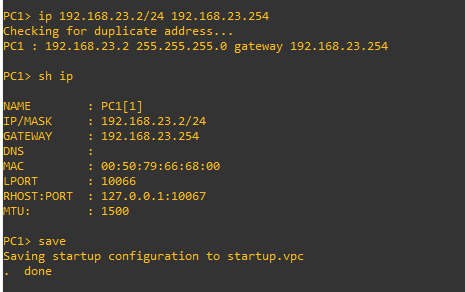

# Practica 4 

Se le solicita configurar y administrar los dispositivos de una infraestructura de red para una compañía la cual está empezando a crecer y quieren ampliar su red, un arquitecto
de redes les proporciona el diseño de la topología que será utilizada como
infraestructura de red para dicha compañía, pero deberán de configurarla para proveer
comunicación de acuerdo con las necesidades que se indican.

La compañía cuenta con 2 departamentos: Contabilidad y Ventas. Se debe proveer
comunicación entre los usuarios del mismo departamento, por ejemplo, los usuarios del
departamento de ventas no se podrán comunicar con ningún otro departamento
solamente con host de su mismo departamento.

## Definición de las redes

| VLAN | Dirección de red | Primera Dirección Asignable | Última dirección asignable | Dirección de Broadcast |
| -- | -- | -- | -- | -- |
| 10 | 192.168.13.0/24 | 192.168.13.1 | 192.168.13.254 | 192.168.13.255 |
| 20 | 192.168.23.0/24  | 192.168.23.1 | 192.168.23.254 | 192.168.23.255 |

## Configuración de la topología de red en GNS3.

#### ==============  Configurar los modos de acceso y/o troncal ==================================

###### ESW1
- conf t
- interface range fastEthernet 1/0 - 4
- switchport mode trunk
- switchport trunk allowed vlan 1,10,20,1002-1005
  
  
  
###### ESW2
- conf t
- interface range fastEthernet 1/1 - 6
- switchport mode trunk
- switchport trunk allowed vlan 1,10,20,1002-1005
  
  
  
###### ESW3
- conf t
- interface range fastEthernet 1/1 - 6
- switchport mode trunk
- switchport trunk allowed vlan 1,10,20,1002-1005
  
  
  
###### Switch 1 
- Posicionarse sobre el sw
- Clic derecho y seleccionar configuración 
- Configurar los puertos conectados como en la siguiente imagen 

  

###### Switch 2 
- Posicionarse sobre el sw
- Clic derecho y seleccionar configuración 
- Configurar los puertos conectados como en la siguiente imagen 

   
   
#### ============= Configurar y crear los siguientes port-channel =================================
###### Po1: entre ESW1 y ESW2
- conf t
- interface range fastEthernet 1/1 - 2
- channel-group 1 mode on
- end
- show etherchannel port-channel

- conf t
- interface range fastEthernet 1/1 - 2
- channel-group 1 mode on
- end
- show etherchannel port-channel

###### Po2: entre ESW1 y ESW3
- conf t
- interface range fastEthernet 1/3 - 4
- channel-group 2 mode on
- end
- show etherchannel port-channel

- conf t
- interface range fastEthernet 1/3 - 4
- channel-group 2 mode on
- end
- show etherchannel port-channel

###### Po3: entre ESW2 y ESW3

- conf t
- interface range fastEthernet 1/5 - 6
- channel-group 3 mode on
- end
- show etherchannel port-channel

- conf t
- interface range fastEthernet 1/5 - 6
- channel-group 3 mode on
- end
- show etherchannel port-channel

#### ================  Configuración de VTP   ===================================================

###### ESW1
- conf t
- vtp domain redes1_201610673
- vtp password redes1_201610673
- vtp mode server
- sh vtp status 

    

###### ESW2
- conf t
- vtp domain redes1_201610673
- vtp password redes1_201610673
- vtp mode client
- sh vtp status 

    

###### ESW3
- conf t
- vtp domain redes1_201610673
- vtp password redes1_201610673
- vtp mode client
- sh vtp status 

    
    
#### ==============  Crear VLAN 10, 20   =========================================================

- conf t
- vlan 10
- name VENTAS
- vlan 20
- name CONTABILIDAD
- end

Para comprobar las vlans
- sh vlan-sw

#### ============= Configurar las Subinterfaces del router  ======================================= 

- conf t  
- interface fastethernet 0/0
- no shutdown
- interface fastEthernet 0/0.10
- encapsulation dot1Q 10
- ip address 192.168.13.254 255.255.255.0

- interface fastEthernet 0/0.20
- encapsulation dot1Q 20
- ip address 192.168.23.254 255.255.255.0
- end

Para comprobar 
- sh ip interface brief 

 
 
#### ============= Configurar PCS y maquina virtual  ==============================================

##### PC1
 1. Comando para configurar la ip 
      * ip 192.168.23.2/24 192.168.23.254
      
 2. Para guardar los cambios 
      * save 
      
 3. Para mostrar la configuración de ip y máscara de red 
      * sh ip 
  
      
  
 ##### PC2
  1. Comando para configurar la ip 
      * ip 192.168.13.5/24 192.168.23.254
      
  2. Para guardar los cambios 
      * save 
   
  3. Para mostrar la configuración de ip y máscara de red 
      * sh ip 
  
      
      
 ##### PC3
  1. Comando para configurar la ip 
      * ip 192.168.23.4/24 192.168.23.254
      
  2. Para guardar los cambios 
      * save 
   
  3. Para mostrar la configuración de ip y máscara de red 
      * sh ip 
  
      
      
 ##### Linux 
 
  1.  Entrar al panel de control y seleccionar Network  
  2. Ingresar la siguiente ip, gateway, máscara de red 
    
      
  
  3. Aplicar y Salir 

  4. Abrir la terminal 
     Comando para mostrar la configuración 
        * ifconfig 

     Comando para comprobar conexion entre las otras pc
        * ping direccion
   

## Captura de paquetes en cualquier parte de la topología

## Diagrama de identificación de rutas principales
